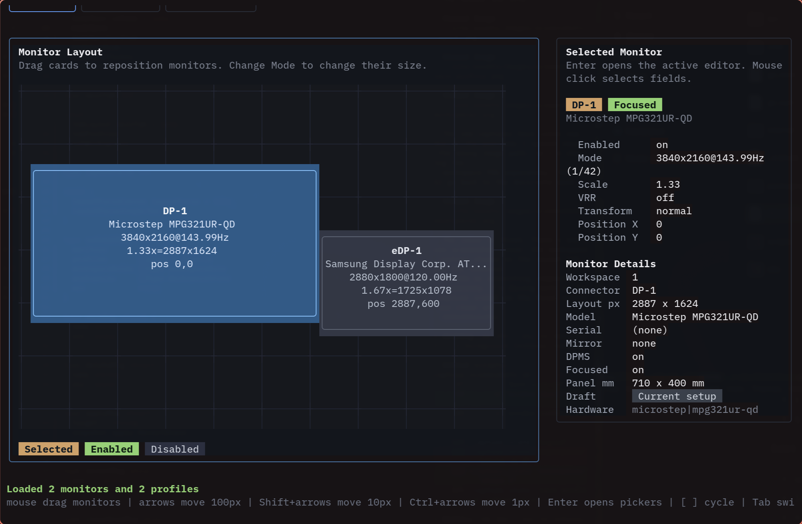
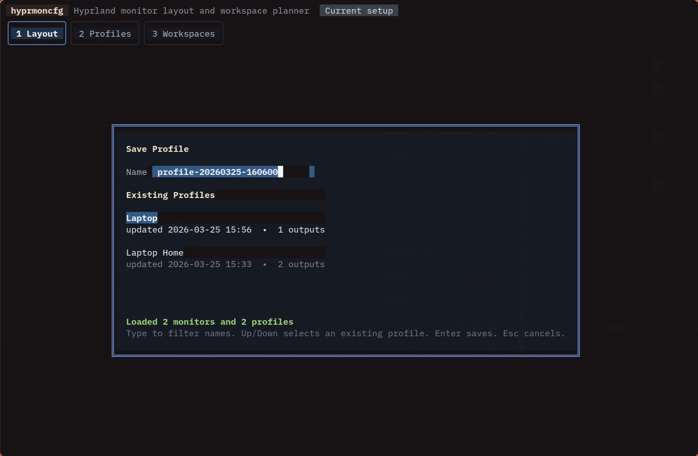

# hyprmoncfg

Terminal-first monitor configuration for Hyprland.

`hyprmoncfg` ships two binaries:

- `hyprmoncfg`: TUI + CLI for monitor layout editing, profile management, and workspace planning
- `hyprmoncfgd`: background daemon that auto-applies the best matching profile on monitor changes



## Why it exists

`hyprmoncfg` is aimed at the same general problem space as Monique, but with a different set of constraints:

- no Python runtime dependency
- a terminal-first interface instead of GTK
- one apply engine shared by both the interactive UI and the daemon
- explicit verification that the chosen `monitors.conf` is actually sourced by Hyprland before writing it

## Features

- spatial monitor layout editor in the terminal
- right-hand inspector for per-monitor properties
- mode picker and typed numeric entry for scale and exact position
- save, load, overwrite, and delete named profiles
- workspace planner with `manual`, `sequential`, and `interleave` strategies
- safe apply with confirm-or-revert support
- automatic profile matching daemon with socket2 events and polling fallback
- profile matching by hardware identity with connector-name fallback

## Screenshots

| Layout | Save Dialog |
| --- | --- |
|  |  |

## Build

```bash
go build -o bin/hyprmoncfg ./cmd/hyprmoncfg
go build -o bin/hyprmoncfgd ./cmd/hyprmoncfgd
```

## Install locally

```bash
install -Dm755 bin/hyprmoncfg ~/.local/bin/hyprmoncfg
install -Dm755 bin/hyprmoncfgd ~/.local/bin/hyprmoncfgd
```

## CLI usage

```bash
hyprmoncfg                 # open the TUI
hyprmoncfg monitors        # list current outputs
hyprmoncfg profiles        # list saved profiles
hyprmoncfg save desk       # save current state as profile "desk"
hyprmoncfg apply desk      # apply a saved profile
hyprmoncfg delete desk     # delete a saved profile
hyprmoncfg version         # build metadata
```

Useful flags:

```bash
hyprmoncfg --config-dir /path/to/config
hyprmoncfg --monitors-conf /path/to/monitors.conf
hyprmoncfg --hypr-config /path/to/hyprland.conf
hyprmoncfg apply desk --confirm-timeout 0
```

## TUI controls

Main controls:

- `1`, `2`, `3`: switch tabs
- `a`: apply current draft or selected profile
- `s`: save current draft as a profile
- `r`: reset from live Hyprland state
- `q`: quit

Layout tab:

- drag monitors with the mouse
- arrows move by `100px`
- `Shift+arrows` move by `10px`
- `Ctrl+arrows` move by `1px`
- `Enter` opens pickers or typed numeric editors
- `[` and `]` cycle selected monitor
- `Tab` switches between canvas and inspector

## Daemon

```bash
hyprmoncfgd
hyprmoncfgd --profile desk
hyprmoncfgd --debounce 1500ms --poll-interval 5s
hyprmoncfgd --monitors-conf ~/.config/hypr/monitors.conf
hyprmoncfgd --hypr-config ~/.config/hypr/hyprland.conf
```

Systemd user service for local installs:

```bash
mkdir -p ~/.config/systemd/user
cp packaging/systemd/hyprmoncfgd.local.service ~/.config/systemd/user/hyprmoncfgd.service
systemctl --user daemon-reload
systemctl --user enable --now hyprmoncfgd
```

## How apply works

The apply engine used by both the TUI and the daemon does this:

1. resolve the target `monitors.conf`
2. verify that `hyprland.conf` actually sources that file
3. write the new config atomically
4. run `hyprctl reload`
5. re-read monitor state and verify the result
6. restore the previous file on revert or failed verification

This avoids the common failure mode where a tool rewrites a config file that Hyprland is not even reading.

## Configuration files

Default profile storage:

```text
~/.config/hyprmoncfg/profiles/*.json
```

Default Hyprland targets:

```text
~/.config/hypr/monitors.conf
~/.config/hypr/hyprland.conf
```

Profiles are stored as JSON because they are machine-owned state, not hand-authored configuration.

## Packaging

Arch recipes live in `packaging/arch`:

- `packaging/arch/hyprmoncfg`
- `packaging/arch/hyprmoncfg-git`

## Docs site

A Jekyll site using the VitePress-style theme lives in `docs/`.

Local preview:

```bash
cd docs
bundle install
bundle exec jekyll serve --livereload
```

GitHub Pages deployment is defined in `.github/workflows/docs.yml`.

## Regenerate screenshots

```bash
./scripts/capture_screenshots.sh
```

The script launches a dedicated terminal window, captures the TUI with `grim`, and writes the PNGs to `docs/assets/images/screenshots/`.

## Development

```bash
go test ./...
go vet ./...
```
