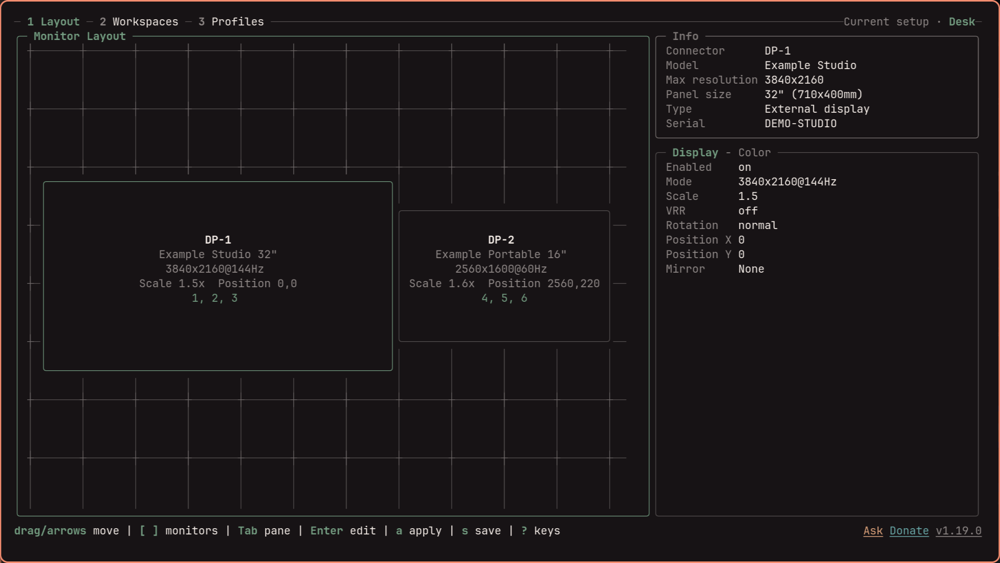

<div align="center">

<picture>
  <source media="(prefers-color-scheme: dark)" srcset="docs/assets/images/logotype_dark.svg">
  
</picture>

<strong>Arrange Hyprland monitors without coordinate math.</strong>

[](https://github.com/crmne/hyprmoncfg/releases)
[](https://aur.archlinux.org/packages/hyprmoncfg)
[](https://goreportcard.com/report/github.com/crmne/hyprmoncfg)
[](https://github.com/crmne/hyprmoncfg/actions/workflows/ci.yml)
[](https://opensource.org/licenses/MIT)

<a href="https://terminaltrove.com/hyprmoncfg/">
  <picture>
    <source media="(prefers-color-scheme: dark)" srcset="docs/assets/images/terminal-trove-tool-of-the-week-dark.svg">
    <source media="(prefers-color-scheme: light)" srcset="docs/assets/images/terminal-trove-tool-of-the-week-light.svg">
    
  </picture>
</a>

</div>

---

hyprmoncfg is a terminal layout editor, CLI, profile store, and hotplug/lid-aware daemon for Hyprland monitor setups. Drag displays into place, save hardware-aware profiles, apply them safely, and let the daemon switch profiles when monitors or your laptop lid changes.


## What you get

- **Spatial layout editor** -- drag monitors on a canvas and tune mode, scale, VRR, mirror, transform, and exact position
- **Named profiles** -- save setups like `desk`, `conference`, or `home-office`
- **Hardware-identity matching** -- profiles follow monitor make, model, and serial instead of unstable connector names
- **Hotplug and lid-aware daemon** -- apply the right profile automatically when monitors change or the laptop lid closes
- **Workspace planner** -- assign workspaces across monitors with sequential, interleave, or manual strategies
- **Safe apply with revert** -- reload Hyprland, verify the result, and revert unless you confirm
- **Include-chain verification** -- refuse to write generated monitor config that Hyprland is not reading
- **Hyprland 0.55 Lua config support** -- use `monitors.lua` automatically when `hyprland.lua` is active, while preserving legacy `monitors.conf` setups
- **One hard runtime dependency** -- Hyprland; UPower is optional for immediate lid events

## Install

Arch Linux:

```bash
yay -S hyprmoncfg
```

Latest `main` from AUR:

```bash
yay -S hyprmoncfg-git
```

Void Linux [(Unofficial Repo)](https://github.com/Event-Horizon-VL/blackhole-vl):

```bash
echo repository=https://raw.githubusercontent.com/Event-Horizon-VL/blackhole-vl/repository-x86_64 | sudo tee /etc/xbps.d/20-repository-extra.conf
sudo xbps-install -S hyprmoncfg
```

Build from source:

```bash
git clone https://github.com/crmne/hyprmoncfg.git
cd hyprmoncfg
go build -o bin/hyprmoncfg  ./cmd/hyprmoncfg
go build -o bin/hyprmoncfgd ./cmd/hyprmoncfgd
install -Dm755 bin/hyprmoncfg  ~/.local/bin/hyprmoncfg
install -Dm755 bin/hyprmoncfgd ~/.local/bin/hyprmoncfgd
```

## Configure Hyprland

Make sure `~/.config/hypr/hyprland.conf` sources `monitors.conf`:

```text
source = ~/.config/hypr/monitors.conf
```

Hyprland does not read that file automatically. hyprmoncfg creates and rewrites `monitors.conf`, then refuses to write if the source chain is missing so you do not edit a file Hyprland ignores.

## Create your first profile

```bash
hyprmoncfg
```

Drag monitors into place, press `s`, type a profile name like `desk`, and press `Enter`.

Apply it later from the CLI:

```bash
hyprmoncfg apply desk
```

## Enable automatic switching

After an AUR install:

```bash
systemctl --user daemon-reload
systemctl --user enable --now hyprmoncfgd
```

After a manual install:

```bash
mkdir -p ~/.config/systemd/user
cp packaging/systemd/hyprmoncfgd.local.service ~/.config/systemd/user/hyprmoncfgd.service
systemctl --user daemon-reload
systemctl --user enable --now hyprmoncfgd
```

The daemon scores every profile in `~/.config/hyprmoncfg/profiles/`, so delete throwaway profiles before relying on automatic switching.

## Screenshots

hyprmoncfg adapts to your theme. Here are some examples:

| Layout editor | Save dialog |
| --- | --- |
|  |  |

## Why it exists

Configuring monitors in Hyprland means writing `monitor=` lines by hand. A 4K display at 1.33x scale is effectively 2880x1620 pixels, so the monitor next to it needs to start at x=2880. Vertically centering a 1080p panel against it means doing division in your head, reloading, noticing the layout is wrong, and editing again.

It gets worse when setups change:

- **No visual editor.** You write `monitor=` lines by hand and hope the coordinates are right.
- **No profiles.** Desk, projector, travel, and docked setups all need different layouts.
- **No automatic switching.** Hotplug a monitor and Hyprland guesses again.
- **Connector names are unstable.** `DP-1` and `DP-2` can swap between boots.
- **Some tools pull in too much.** Python, GTK, and GObject introspection are a lot of stack just to move a rectangle.

## How it works

hyprmoncfg ships two binaries:

| | |
|---|---|
| `hyprmoncfg` | TUI + CLI for layout editing, profile management, and workspace planning |
| `hyprmoncfgd` | Background daemon that auto-applies the best matching profile on hotplug and lid changes |

Both use the same apply engine:

```bash
write monitors.conf -> reload Hyprland -> verify live state -> confirm or revert
```

There is no separate best-effort daemon path. If the TUI can apply a profile correctly, the daemon uses the same machinery.

## Dotfiles integration

Profiles live in `~/.config/hyprmoncfg/profiles/`. They're plain JSON files, one per profile. Add the directory to your dotfile manager and your layouts roam across every machine you own.

With [chezmoi](https://www.chezmoi.io/):

```bash
chezmoi add ~/.config/hyprmoncfg
```

Now your desk at home, your laptop on the road, and your Raspberry Pi in the closet all share the same profile library. The daemon picks the right one based on what's actually plugged in.

You don't commit `monitors.conf` or `monitors.lua`. You commit your profiles. The tool writes the active generated monitor config for you.

## How it compares

| | hyprmoncfg | Monique | HyprDynamicMonitors | HyprMon | nwg-displays | kanshi |
|---|---|---|---|---|---|---|
| GUI or TUI | TUI | GUI | TUI | TUI | GUI | CLI |
| Spatial layout editor | Yes | Yes | Partial | Yes | Yes | No |
| Drag-and-drop | Yes | Yes | No | Yes | Yes | No |
| Snapping | Yes | Not documented | No | Yes | Yes | No |
| Profiles | Yes | Yes | Yes | Yes | No | Yes |
| Auto-switching daemon | Yes | Yes | Yes | No (roadmap) | No | Yes |
| Workspace planning | Yes | Yes | No | No | Basic | No |
| Mirror support | Yes | Yes | Yes | Yes | Yes | No |
| Safe apply with revert | Yes | Yes | No | Partial (manual rollback) | No | No |
| Hyprland 0.55 Lua config | Yes | No | No | No | Yes | N/A |
| Include-chain verification | Yes | No | No | No | No | No |
| Additional runtime dependencies | None | Python + GTK4 + libadwaita | UPower, D-Bus | None | Python + GTK3 | None |

## Docs

Full documentation at **[hyprmoncfg.dev](https://hyprmoncfg.dev)**.

## Development

Install the pre-commit hook to run CI checks locally before each commit:

```bash
ln -sf "$(pwd)/scripts/pre-commit" .git/hooks/pre-commit
```

The hook runs `go mod tidy`, `go vet`, `go test`, and `go build`.

Regenerate screenshots:

```bash
./scripts/capture_screenshots.sh
```

## License

MIT
